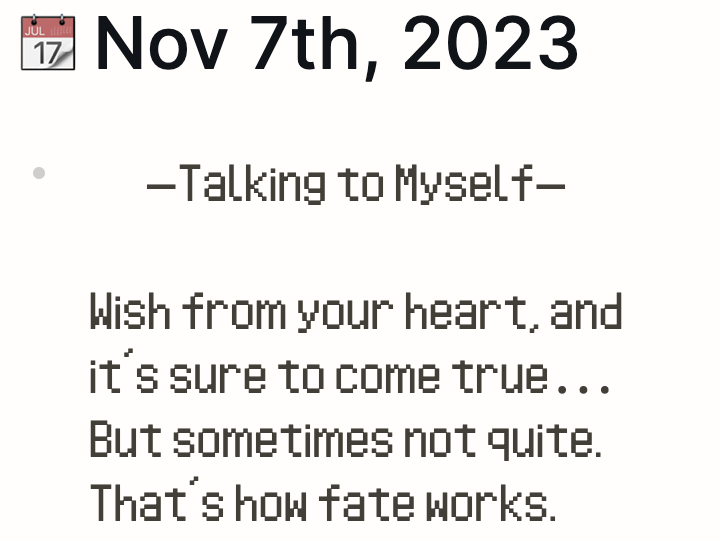
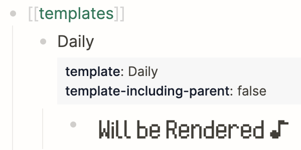

# Logseq AC Keijiban
A basic Logseq renderer that displays a bulletin board message from _Animal Crossing: Wild World_.

Data is directly taken from [AC-Keijiban](https://github.com/helmasaur/ac-keijiban) by [helmasaur](https://github.com/helmasaur).  I just pulled it into this project and changed the code a bit to support ESM modules and the little header text you see.

### Display Conditions
The plugin is designed to have messages be displayed at a fixed point relative to the date and not change as you reloaded / navigate.

The "Message of the Week" of the week is set to display on mondays by default, but can be changed to Sunday in the plugin settings.

### Template
The plugin will display a little confirmation message when it is inside a template to let you know it'll function.

### Settings

#### Language
Select the language to display in.  French not complete, see [AC-Keijiban#translation](https://github.com/helmasaur/ac-keijiban#translation)

#### Font Size
Sets the font size of the output.

#### Start of the Week
Let's you toggle between Monday and Sunday as the start of the week.  Determines when to pull from the "Message of the Week" set.

### Todo
- [ ] Setting for selecting which set of messages to use.
- [ ] Would be cool to make it look like it does in game...

### Source Code Formatting
If anything looks weird in there, blame prettier!

## Thanks
- Again big thanks to [helmasaur](https://github.com/helmasaur).  I've had that project bookmarked for years and always wanted to use it in something.
